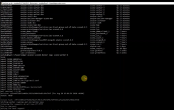

<!--
Licensed under Creative Commons Attribution 4.0 International License
https://creativecommons.org/licenses/by/4.0/
-->
# Hyperledger Avalon SCONE Documentation

## Introduction
* [README](../README.md). Overview of Avalon and its source code
* [FAQ](./FAQ.rst). Frequently-asked questions with answers about Avalon
  * [Glossary](./FAQ.rst#glossary)
* [Hyperledger Avalon SCONE demo](https://drive.google.com/file/d/1cvAZFJGkGXEHFVFMG_QnTOEDjZFlpgbO/view?usp=sharing)

## Community
* [Email](mailto:mujtaba.idrees@t-systems.com)

## Avalon Tutorials
* [Workload Application Tutorial](./workload-tutorial/)
* [Example Applications](../examples)
* Avalon Proxy Model Demos with:
  * [Avalon Proxy model with Ganache and Ethereum](./TestingGanacheProxyModel.rst)
  * [Avalon Proxy model with Besu and Ethereum](./TestingBesuProxyModel.rst)
  * [Avalon Proxy model with Hyperledger Fabric](./TestingFabricProxyModel.rst)

## Source Code
* [Avalon SCONE source code repository](https://github.com/T-Systems-MMS/hyperledger-avalon-scone)
* [Building source code](../BUILD.md)
* [Example Avalon applications](../examples/apps)

## Reference
* [_Hyperledger Avalon SCONE Whitepaper_](./whitepaper_avalon_scone.pdf).
  Fork of Hyperledger Avalon that supports SCONE workers, by Mujtaba Idrees (2021)
* [_Hyperledger Avalon Architecture Overview_](
  https://github.com/hyperledger/avalon/blob/master/docs//avalon-arch.pdf).
  Overview of Avalon architecture by Eugene Yarmosh (2020)
* [ _Off-Chain Trusted Compute Specification_](
  https://entethalliance.github.io/trusted-computing/spec.html)
  defined by Enterprise Ethereum Alliance (EEA) Task Force
* [Cryptography](../common/cpp/crypto/README.md). Cryptographic primitives
  used, libraries used, and implementation
